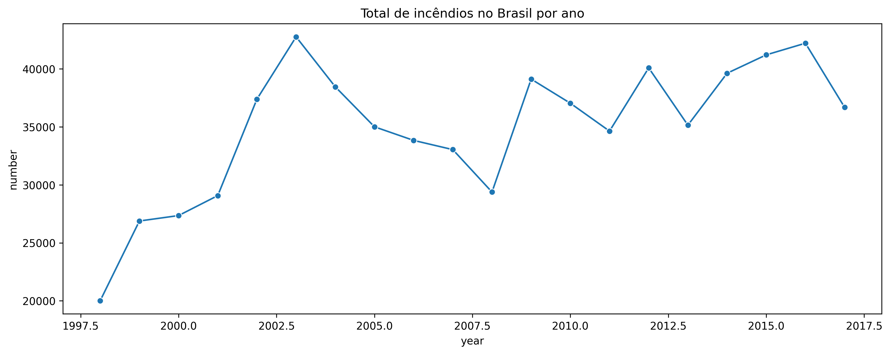
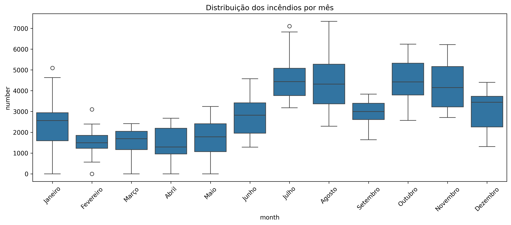
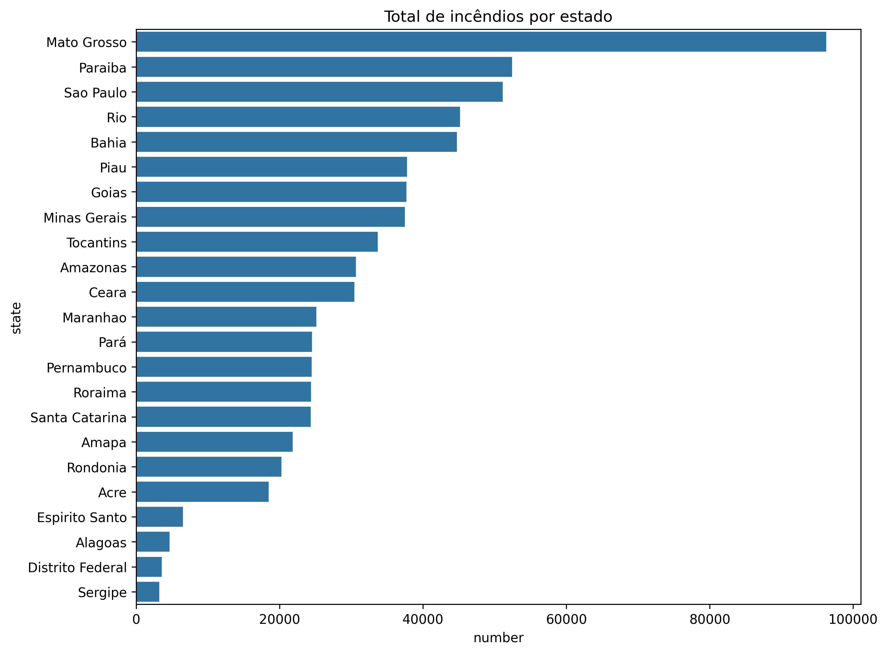

# Análise de Incêndios Florestais no Brasil (1998 - 2017)

## 1. Apresentação do Projeto
Este projeto realiza uma análise exploratória de dados (EDA) sobre a ocorrência de incêndios florestais no Brasil ao longo de duas décadas. Utilizando técnicas de Data Analytics, o estudo identifica padrões temporais e geográficos que auxiliam na compreensão da dinâmica das queimadas no território nacional.

## 2. Objetivo
O objetivo principal é mapear a evolução histórica dos focos de incêndio, identificar os períodos de maior incidência (sazonalidade) e os estados brasileiros mais afetados, fornecendo subsídios para estratégias de prevenção e controle ambiental.

## 3. Base de Dados e Período
* **Fonte:** Dataset histórico contendo registros de incêndios florestais.
* **Período Analisado:** 1998 a 2017 (20 anos).
* **Escopo:** Dados nacionais segregados por estados e meses.

## 4. Tecnologias e Bibliotecas
* **Linguagem:** Python
* **Manipulação de Dados:** `Pandas`
* **Visualização Estática:** `Matplotlib`, `Seaborn`
* **Visualização Interativa:** `Plotly Express` (Density Map, Line charts)

## 5. Etapas da Análise
1. **Carregamento e Limpeza:** Integração com Google Drive e verificação de integridade dos dados.
2. **Análise Descritiva:** Levantamento de estatísticas gerais e contagem de ocorrências.
3. **Análise Temporal:** Estudo da evolução anual e identificação de tendências de longo prazo.
4. **Análise de Sazonalidade:** Identificação dos meses com maior volume de focos.
5. **Análise Geoespacial:** Mapeamento do ranking de estados e visualização geográfica.

## 6. Principais Insights e Resultados

### 📈 Evolução Histórica
Observa-se um pico significativo no número total de incêndios no Brasil por volta de **2003**, seguido por variações cíclicas com novos aumentos registrados entre 2015 e 2016.

### 🗓️ Sazonalidade Mensal
A distribuição mensal revela que o período crítico ocorre no segundo semestre. Os meses de **Julho a Novembro** concentram as maiores variações e números elevados de focos, coincidindo com o período de estiagem.

### 📍 Estados Mais Afetados
O estado de **Mato Grosso** lidera o ranking nacional de ocorrências, seguido por Paraíba e São Paulo. A análise geográfica reforça a pressão ambiental nas áreas de transição agrícola e florestal.

## 7. Estrutura do Repositório
* `Projeto_Incendios_Florestais.ipynb`: Notebook com o código completo.
* `images/`: Gráficos exportados para exibição no README.
* `README.md`: Documentação profissional do projeto.

## 8. Como Executar
1. Clone o repositório.
2. Instale as dependências: `pip install pandas matplotlib seaborn plotly`.
3. Execute o notebook para reproduzir as análises.

---
**Autor:** [AlissonFelipeBS](https://github.com/AlissonFelipeBS)

